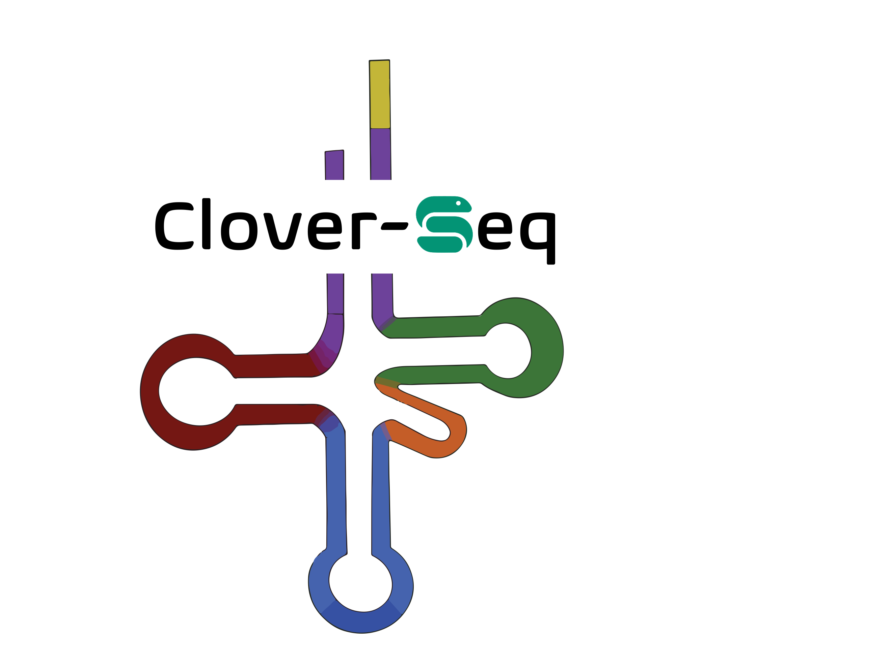
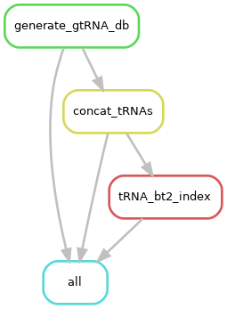

# clover-Seq
Snakemake workflow for the analyses of mature tRNAs and other smRNAs from high-throughput sequencing




# Table of Contents
- [Development To Do](#development_to_do)
- [Introduction](#introduction)
- [Databases](#databases)
- [Database Build Implementation](#database_build_implementation)
- [Development Notes](#development_notes)
- [Pipeline Summary](#pipeline_summary)
- [Directories](#directories)
- [Files](#files)
- [Implementation](#implementation)
- [Contact](#contact)
- [Citation and Licensing](#citation_and_licensing)


## Development To Do
- Within each database directory in GMBSR/genomic_references, run the `make_all_feature_bed.py` code to generate an `allfeats.bed` file. Also include a README in each database that says how this file is ran.
Or, add it as a snakemake rule for the database build snakemake (probably go with this for cleanliness)

```shell
python make_all_feature_bed.py \
    db-maturetRNAs.bed \
    db-trnaloci.bed \
    genes.gtf
```

- Instead of using awk counting of idxstats for `rule tRNA_count`, implement `countreads.py` in a similar fashion to how `rule count_smRNAs` is implemented.

- Improve visualizations for exploratory analysis. 
    - Compare R median of ratios normalization script to miRNA-PCA script

- Add R visualization scripts to their own subfolder in the `code` directory

- **DOUBLE CHECK** that our mapping strategy allows for multi-mapping which is super important because of codon degeneracy.

- Start working on differential expression workflow

- Add database building workflow implementation to README

## Introduction
This pipeline supports the analysis of mature-tRNAs and other small RNAs (smRNAs) for human (hg38), mouse (mm10), and fly(dm6) genomes. While typical RNA-Seq preprocessing strategies are employed in this pipeline, special considerations to handle tRNA biology are included. Custom reference databases encompass the full host genome along with mature tRNA transcripts with the addition of 3' CCA tails not encoded genomically. 

Following preprocessing workflow, differential expression can be performed using the differential expression workflow included in this repo (FUTURE)


## Databases
tRNA-genome references encompass the full host genome with additional tRNA-specific gene information obtained from [gtRNAdb](https://gtrnadb.ucsc.edu) through [tRNA-scan](https://lowelab.ucsc.edu/tRNAscan-SE/) experiments. Encompassed in these databases are bed files of mature tRNA sequences as well as native pre-tRNA loci in the host genome. Stockholm alignment files and alignment-number files help with downstream conversion of tRNA alignments to [Sprinzl-positions](http://polacek.dcbp.unibe.ch/publications/Holmes%20et%20al_tDR%20nomenclature_Nat.Meth_2023.pdf). 

These references are pre-downloaded along with pre-built Bowtie2 indices and hosted on the [Genomics and Molecular Biology Shared Resources](https://geiselmed.dartmouth.edu/gsr/) on Discovery for ease of use and efficiency. However, if you wish to build from scratch, or customize the reference, a workflow for doing so is included. 

For more information on the files included in the database, see [Files](#files)

References can be accessed at the following path on Discovery: 

`/dartfs-hpc/rc/lab/G/GMBSR_bioinfo/genomic_references/tRAX_databases`

## Database Build Implementation


Explanation here...


## Pipeline Summary
Clover-Seq is adapted from the [tRAX Pipeline](https://github.com/UCSC-LoweLab/tRAX) to be implemented as a Snakemake workflow to allow sample parallelization and efficiency. As input, this pipeline takes raw fastq.gz files, a config.yaml file, and two text files to guide the Snakemake script.

|Snakemake Rule|Purpose|Conda Environent|
|--------------|-------|----------------|
|`trimming`|Trim fastq files to remove adapters and reads not meeting size threshold|`tRAX_env`|
|`tRNA_align`|Align sequencing reads to combined tRNA sequences and host genome, perform length and quality filtering|`tRAX_env`|
|`tRNA_mark_duplicates`|Flag sequencing duplicates|`rnaseq1`|
|`tRNA_map_stats`|Collate idxstats and flagstats metrics|`tRAX_env`|
|`tRNA_count`|Count tRNA reads|`rnaseq1`|
|`count_smRNAs`|Count tRNA + smRNAs|`tRAX_env`|


## Development Notes:

To run getcoverage.py from the command line (within code folder)--- Ensure you have trax_env activated
```shell
python getcoverage.py --bedfile=/dartfs-hpc/rc/lab/G/GMBSR_bioinfo/genomic_references/tRAX_databases/hg38_db/db-maturetRNAs.bed --samplefile=MM_Working_Scripts/sample_file.txt --stkfile=/dartfs-hpc/rc/lab/G/GMBSR_bioinfo/genomic_references/tRAX_databases/hg38_db/db-trnaalign.stk --allcoverage=all-coverage.txt --trnafasta=/dartfs-hpc/rc/lab/G/GMBSR_bioinfo/genomic_references/tRAX_databases/hg38_db/db-maturetRNAs.fa --sizefactors=test/test-SizeFactors.txt --locistk=/dartfs-hpc/rc/lab/G/GMBSR_bioinfo/genomic_references/tRAX_databases/hg38_db/db-trnaloci.stk 
```

To run processsamples.py from the command line
```shell
python 03_processsamples.py --experimentname=test --databasename=/dartfs-hpc/rc/lab/G/GMBSR_bioinfo/genomic_references/tRAX_databases/hg38_db/db --ensemblgtf=/dartfs-hpc/rc/lab/G/GMBSR_bioinfo/genomic_references/tRAX_databases/hg38_db/genes.gtf --samplefile=MM_Working_Scripts/sample_file.txt --bamdir=/dartfs-hpc/rc/lab/G/GMBSR_bioinfo/misc/shared-software/workflows/clover-Seq/tRNA_alignment/ --nofrag --exppairs=MM_Working_Scripts/pairfile.txt

```

To run countreadtypes.py from the command line
```shell
python count_all_smRNA.py --samplefile=MM_Working_Scripts/sample_file.txt --trnatable=/dartfs-hpc/rc/lab/G/GMBSR_bioinfo/genomic_references/tRAX_databases/hg38_db/db-trnatable.txt --ensemblgtf=/dartfs-hpc/rc/lab/G/GMBSR_bioinfo/genomic_references/tRAX_databases/hg38_db/genes.gtf --trnaloci=/dartfs-hpc/rc/lab/G/GMBSR_bioinfo/genomic_references/tRAX_databases/hg38_db/db-trnaloci.bed --maturetrnas=/dartfs-hpc/rc/lab/G/GMBSR_bioinfo/genomic_references/tRAX_databases/hg38_db/db-maturetRNAs.bed --trnaaminofile=trna_amino_counts.txt --readlengthfile=read_lengths.txt --realcountfile=real_counts.txt --countfile=counts.txt
```

## Citation and Licensing

**This codebase is adapted from the original tRAX tool, licensed under GPL v3.0.** 

**Holmes AD, Howard JM, Chan PP, and Lowe TM.** tRNA Analysis of eXpression (tRAX): A tool for integrating analysis of tRNAs, tRNA-derived small RNAs, and tRNA modifications. 2020. (submitted)

Modifications were made by Mike Martinez (Dartmouth Genomic Data Science Core)

This pipeline is licensed under GNU General Public License


