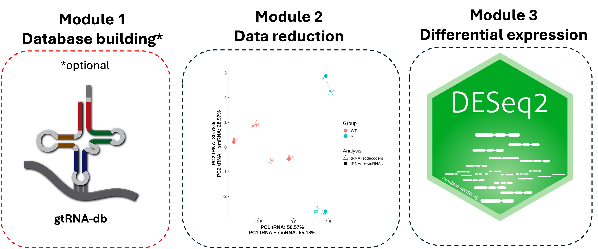
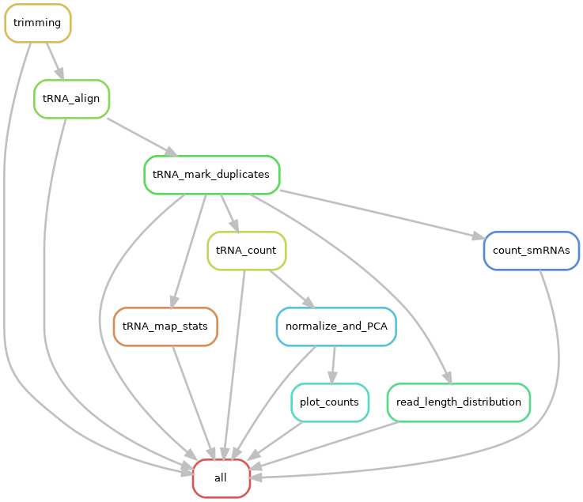

# Clover-Seq Pipeline Documentation


Snakemake workflow for the comprehensive analyses of mature tRNAs and other small RNAs (smRNAs) from high-throughput sequencing data. 


# Table of Contents
- [Development To Do](#development-to-do)
- [Introduction](#introduction)
- [Installation](#installation)
- [Database Build Module (Optional)](#database-building-module-optional)
- [Database Build Implementation](#database-build-implementation)
- [Preprocessing Module](#pipeline-summary)
- [Preprocessing Implementation](#preprocessing-implementation)
- [Preprocessing Outputs](#preprocessing-outputs)
    - [01 Trimming](#01-trimming)
    - [02 tRNA Alignment and Alignment Stats](#02-trna-alignment-and-alignment-stats)
    - [03 tRNA Counts](#03-trna-counts)
    - [04 smRNA Counts](#04-smrna-counts)
    - [05 Normalized](#05-normalized)
    - [06 PCA](#06-pca)
    - [07 Rds Files](#07-rds-files)
    - [08 Plots](#08-plots)
    - [09 QC](#08-qc)
- [Differential Expression Implementation](#differential-expression-implementation)
- [Files](#files)
- [Development Notes](#development-notes)
- [Contact](#contact)
- [Citation and Licensing](#citation-and-licensing)


## Development To Do
- Within each database directory in GMBSR/genomic_references, run the `make_all_feature_bed.py` code to generate an `allfeats.bed` file. Also include a README in each database that says how this file is ran.
Or, add it as a snakemake rule for the database build snakemake (probably go with this for cleanliness)

```shell
python make_all_feature_bed.py \
    db-maturetRNAs.bed \
    db-trnaloci.bed \
    genes.gtf
```

- Loadings file is currently outputting eigenvectors and not loadings. This needs to be changed in the PCA R script.

- Need to generate visualizations for uniquely mapped, multimapped, unmapped, type-counts, CCA endpoint barplots, amino counts, read length distributions (both total and tRNA/pre-tRNA)

- Start working on differential expression workflow

- Add database building workflow implementation to README

- Make prebuilt preprocessing configs for each genome

- Add make_feature_bed rule to database snakemake workflow


## Introduction
This pipeline supports the analysis of mature-tRNAs and other small RNAs (smRNAs) for human (hg38), mouse (mm10), and fly(dm6) genomes through 3 main modules: 



While typical RNA-Seq preprocessing strategies are emplyed in this pipeline, special considerations to handle tRNA biology are included. Custom reference databases encompass putative mature tRNAs as well as unique tRNA isodecoders as well as tRNA loci in the native host genome along with other annotated smRNAs including miRNA, sRNA, siRNA, snRNA, snoRNA, ribozymes and others. Mature tRNA transcripts are modified to include the addition of a 3' CCA tail which are not encoded genomically. Results are reported at two levels: the gene level which included mature tRNAs plus all other native tRNA-loci and smRNAs, and the isodecoder level, which is tRNA-specific.

## Installation
To install this code, clone the github repository

```shell
#----- Clone repository
git clone https://github.com/mikemartinez99/clover-Seq

```

Several [conda environments](https://anaconda.org/anaconda/conda) are required to run this code successfully. For your convenience, these conda environments have been prebuilt and are hosted publically at the following path:

`/dartfs/rc/nosnapshots/G/GMBSR_refs/envs/GDSC-Clover-Seq`

If you wish to build these environments yourself, the associated yaml file in the [env_config folder](https://github.com/mikemartinez99/clover-Seq/tree/main/env_config) can be built using the following command:

```shell
#----- Build conda environment
conda env create -f env_config/<name.yaml>
```


## Database Build Module (Optional)
tRNA-genome references encompass the full host genome with additional tRNA-specific gene information obtained from [gtRNAdb](https://gtrnadb.ucsc.edu) through [tRNA-scan](https://lowelab.ucsc.edu/tRNAscan-SE/) experiments. Encompassed in these databases are bed files of mature tRNA sequences as well as native pre-tRNA loci in the host genome. Stockholm alignment files and alignment-number files help with downstream conversion of tRNA alignments to [Sprinzl-positions](http://polacek.dcbp.unibe.ch/publications/Holmes%20et%20al_tDR%20nomenclature_Nat.Meth_2023.pdf). 

These references are pre-downloaded along with pre-built Bowtie2 indices and hosted on the [Genomics and Molecular Biology Shared Resources](https://geiselmed.dartmouth.edu/gsr/) on Discovery for ease of use and efficiency. However, if you wish to build from scratch, or customize the reference, a workflow for doing so is included. 


|Snakemake Rule|Purpose|Conda Environent|
|--------------|-------|----------------|
|`generate_gtRNA_db`|Download Ensembl GTF, gtRNA-db data tarball, genome and tRNA fasta file and build resulting tRNA database for downstream analysis in the preprocessing module|`clover-seq`|
|`concat_tRNAs`|Concatenate mature tRNA fasta and genome fasta to get tRNA-genome fasta file for use in profiling all smRNAs|`clover-seq`|
|`tRNA_bt2_index`|Create Bowtie2 index of tRNA-genome for use in alignment step of preprocessing module|`clover-bowtie2`|


## Database Build Implementation

References can be accessed at the following path on Discovery: 

`/dartfs-hpc/rc/lab/G/GMBSR_bioinfo/genomic_references/tRAX_databases`

If you do not wish to use a pre-built database, a fresh one can be created using the following steps.

1. Update your `database_build.sh` script to point Snakemake to one of the database configs in `database_configs` folder. These configs are organism-specific and point to specific URLs on [gtRNAdb](https://gtrnadb.ucsc.edu). 

```shell
#----- Snakemake call
snakemake -s database_Snakefile.smk \
    --configfile database_configs/hg38_db_config.yaml \     # EDIT THIS LINE
    --use-conda \
    --conda-frontend conda \
    --conda-prefix /dartfs/rc/nosnapshots/G/GMBSR_refs/envs/GDSC-Clover-Seq \
    --profile cluster_profile \
    --rerun-incomplete \
    --keep-going 

```

2. Submit your `database_build.sh` script

```shell
#----- Submit snakemake job
sbatch database_build.sh

```

To check the status of your Snakemake job and all child jobs it spawns, run the following (replacing NETID with your Dartmouth NetID)
**Note** This applied for all 3 modules!

```shell
#----- Check user job status
squeue | grep "NETID"
```

You will notice your directory will populate with logs following the convention: log_X_RuleID_JobID.out. For rules that run on a per-sample basis, there should be one log for each sample. For rules that run once for all samples together, there should be only a single log. 

## Preprocessing Module
Clover-Seq is adapted from the [tRAX Pipeline](https://github.com/UCSC-LoweLab/tRAX) to be implemented as a Snakemake workflow, allowing sample parallelization and improved modularity and efficiency. As input, this pipeline takes raw fastq.gz files, a config.yaml, and a sample metadata sheet.



|Snakemake Rule|Purpose|Conda Environent|
|--------------|-------|----------------|
|`trimming`|Trim fastq files to remove adapters and reads not meeting size threshold|`clover-seq`|
|`tRNA_align`|Align sequencing reads to combined tRNA sequences and host genome, perform length and quality filtering|`clover-bowtie2`|
|`tRNA_mark_duplicates`|Flag sequencing duplicates|`Picard`|
|`tRNA_map_stats`|Collate idxstats and flagstats metrics|`clover-seq`|
|`tRNA_count`|Count tRNA isotype reads as well as gene-level tRNAs/smRNAs in the genome|`clover-seq`|
|`read_length_distribution`|Collate read-length statistics for all reads (tRNA + non-tRNA)|`clover-seq`|
|`count_smRNAs`|Collate smRNA biotype counts across groups and samples|`clover-seq`|
|`normalize_and_PCA`|Calculate size factors and normalized-counts for tRNA-isotypes and gene-level counts, run PCA|`clover-seq`|

## Preprocessing Implementation
To run the preprocessing pipeline, modify the `Sample_list_SE.txt` file. This is a comma-delimited three column file (Sample_ID, fastq_1, Group).
Note that modifying header names will cause the pipeline to fail! Simply modify your sample names, path to the raw fastq.gz file, and Group. Below is an example of how this file should look. 

```text
Sample_ID,fastq_1,Group
IB1,data/IB_1_S1_R1_001.fastq.gz,WT
IB2,data/IB_2_S2_R1_001.fastq.gz,WT
IB3,data/IB_3_S3_R1_001.fastq.gz,KO
IB4,data/IB_4_S4_R1_001.fastq.gz,KO

```

The `config.yaml` file provides important file paths that allow the Snakefile to dynamically run. Utilize the config specific to your organism in the [preprocessing prebuilt configs folder](https://github.com/mikemartinez99/clover-Seq/tree/main/preprocessing_prebuilt_configs). A list of case-sensitive parameters as specified in the config are listed below:

|Parameter|Value|
|---------|-----|
|`sample_txt`|Sample_list_SE.txt|
|`layout`|one of `single` or `paired` (currently only supports single)|
|`genome`|one of `hg38`, `mm10`, or `dm6`|
|`refLevel`|A reference level from the group column in Sample_list_SE.txt|
|`trna_db`|Path to publically hosted, pre-built tRNA databases|
|`bt2_index`|Path + bowtie2 index prefix for publically hosted, pre-built tRNA genome Bowtie2 index|
|`adapter_1`|Adapter sequence 1 (Illumina universal)|
|`adapter_2` |Adapter sequence 2 if paired-end (Illumina universal)|
|`maxMaps`|Number of mutli-mappings to accept per read|
|`nPenalty`|Penalty score for ambiguous bases (set to 5 to account for tRNA biology)|


Modify the `job.script.sh` script accordingly to point to your config file using the `--configfile` argument. Below is an example using the hg38 tRNA genome and specifying to submit 10 jobs in parallel across different cluster nodes as specified by `--profile cluster_profile`

```shell
#----- Run snakemake workflow
snakemake -s Snakefile \
    --use-conda \
    --configfile /preprocessing_prebuilt_configs/hg38_config.yaml \     # EDIT THIS LINE
    --conda-frontend conda \
    --conda-prefix /dartfs/rc/nosnapshots/G/GMBSR_refs/envs/GDSC-Clover-Seq \
    --profile cluster_profile \
    --rerun-incomplete \
    --keep-going 
```

To submit your job, run the following code. 

```shell
#----- Submit snakemake job script
sbatch job.script.sh
```
To check the status of your Snakemake job and all child jobs it spawns, run the following (replacing NETID with your Dartmouth NetID)


## Preprocessing Outputs
The preprocessing module of this workflow contains 8 major output sections across multiple folders. Their outputs are explained below

### 01 Trimming
Contains trimmed fastq files and trimming logs in the `logs` folder (if SE and using CutAdapt)

### 02 tRNA Alignment and tRNA Alignment Stats
Contains multiple alignment files. Additionally, a third folder (02_tRNA_unaligned) holds fastq files containing reads that did not align to the tRNA-genome. 

|Files|Content|Rule|
|-----|-------|----|
|`.srt.bam`|Bam files sorted by coordinate and filtered for reads between 15-90 bp|`rule tRNA_alignment`|
|`.alignment.log.txt`|Bowtie2 alignment log|`rule tRNA_alignment`|
|`.mkdup.bam`|Filtered and sorted bam file with duplicates flagged|`rule tRNA_mark_duplicates`|
|`.mkdup.log.txt`|Picard Markduplicates log file|`rule tRNA_mark_duplicates`|
|`stats/.mkdup.bam.idxstats`|Samtools idxstats metrics|`rule tRNA_map_stats`|
|`stats/.mkdup.bam.flagstat`|Samtools flagstat metrics|`rule tRNA_map_stats`|
|`full_alignment_read_length_distribution.txt`|Per-sample read length distribution information for all reads|`read_length_distribution`|

### 03 tRNA Counts
Contains detailed per-sample tRNA count information at the gene and isoform level.

|Files|Content|Rule|
|-----|-------|----|
|`genetype_counts.txt`||`rule tRNA_count`|
|`tRNA_isotype_counts.txt`|Per sample counts of tRNA isoforms|`rule tRNA_count`|
|`gene_level_counts_detailed.txt`|Per sample counts of tRNAs broken down by read type (5', 3' antisense, other) and genome smRNAs/tRNA-loci|`rule tRNA_count`|
|`gene_level_counts_collapsed.txt`|Per sample counts of tRNAs collapsed to isodecoder level and genome smRNAs|`rule tRNA_count`|
|`tRNA_ends_counts.txt`|Contains counts for CCA, CC, and C ending tRNAs|`rule tRNA_count`|

### 04 smRNA Counts
Contains detailed per-sample smRNA count information at the gene biotype level for tRNAs and other smRNAs.

|Files|Content|Rule|
|-----|-------|----|
|`raw_amino_counts_by_group.txt`|Per-greoup raw total counts for all amino acids|`rule smRNA_count`|
|`read_length_distribution.txt`|Per-sample read length distribution for tRNAs split by pre-tRNAs and mature tRNAs|`rule smRNA_count`|
|`smRNA_raw_counts_by_group.txt`|Per-group raw total counts for all smRNA gene biotypes|`rule smRNA_count`|
|`smRNA_raw_counts_by_sample.txt`|Per-sample raw total counts for all smRNA gene biotypes|`rule smRNA_count`|

### 05 Normalized
Contains normalization information, and normalized tRNA counts.

|Files|Content|Rule|
|-----|-------|----|
|`gene_level_counts_size_factors.csv`|Per-sample size factors calculated by median-of-ratios (DESeq2) for tRNA isodecoders + genomic smRNAs|`rule normalize_and_PCA`|
|`normalized_gene_level_counts.csv`|Per-sample normalized counts calculated by rlog transformation (DESeq2) for tRNA isodecoders + genomic smRNAs|`rule normalize_and_PCA`|
|`tRNA_isotype_counts_size_factors`|Per-sample size factors calculated by median-of-ratios (DESeq2) for tRNA isotypes only|`rule normalize_and_PCA`|
|`normalized_tRNA_isotype_counts.csv`|Per-sample normalized counts calculated by rlog transformation (DESeq2) for tRNA isotypes only|`rule normalize_and_PCA`|
|`CCA_ends_normalized.csv`|CCA-end counts normalized using tRNA-isotype dataset size factors|`rule plot_counts`|

### 06 PCA
Contains tabular data for principal component analysis and associated PCA plots.

|Files|Content|Rule|
|-----|-------|----|
|`gene_level_variance_plot.png`|Shows ranked gene variances for rlog-normalized tRNA isodecoders + genomic smRNAs|`rule normalize_and_PCA`|
|`gene_level_loadings.csv`|PCA loadings per sample based on 500 most variable features for rlog-normalized tRNA isodecoders + genomic smRNAs|`rule normalize_and_PCA`|
|`gene_level_PCA.png`|PCA plot based on 500 most variable features for rlog-normalized tRNA isodecoders + genomic smRNAs|`rule normalize_and_PCA`|
|`tRNA_isotype_variance_plot.png`|Shows ranked gene variance for rlog-normalized tRNA isotypes only|`rule normalize_and_PCA`|
|`tRNA_isotype_loadings.csv`|PCA loadings per sample based on 500 most variable features for rlog-normalized tRNA isotypes only|`rule normalize_and_PCA`|
|`tRNA_isotype_PCA.png`|PCA plot based on 500 most variable features for rlog-normalized tRNA isotypes only|`rule normalize_and_PCA`|
|`PCA_Analysis_Summary.png`|Side by side PCA plots for full gene-level and tRNA only analysis|`rule normalize_and_PCA`|
|`PCA_Direct_Comparison.png`|PCA data for both experiments on one plot to highlight shifts|`rule normalize_and_PCA`|


### 07 RDS Files

Contains DESeq2 serialized R-data objects to be used in the differential expression workflow.

|Files|Content|Rule|
|-----|-------|----|
|`gene_level_DESeq2_object.Rds`|DESeq dataset object for tRNA isodecoders + genomic smRNAs dataset with (reference level set in config)|`rule normalize_and_PCA`|
|`tRNA_isotype_DESeq2_object.Rds`|DESeq dataset object for tRNA isotypes only (reference level set in config)|`rule normalize_and_PCA`|

### 08 Plots
Contains various plots to explore counts.

|Files|Content|Rule|
|-----|-------|----|
`CCA_ends_normalized_absolute_abundances.png`|Absolute abundances of CCA end types per sample, normalized using tRNA-isotype size factors with resulting normalized tabular data saved in 05_normalized folder|`rule plot_counts`|
|`CCA_ends_relative_abundances.png`|Relative abundances (calculated from non-normalized CCA-end counts) of CCA end types per sample|`rule plot_counts`|
|`Grouped_boxplot_norm_tRNA_isotypes_by_Sample_and_Anticodon.png`|High detial plot showing counts of each tRNA isotype for specific codons|`rule plot_counts`|
|`Isoacceptor_counts_normalized.png`|Normalized absolute abundance of each isoacceptor type|`rule plot_counts`|
|`Isoacceptor_counts_by_sample_normalized.png`|Absolute composition of amino-acids by Sample|`rule plot_counts`|


### 09 QC

Contains general QC summary in html format with associated data tables

|Files|Content|Rule|
|-----|-------|----|
|`tRNA_multi_QC_report_data`|Folder containing multi-qc data|`rule all`|
|`tRNA_multi_QC_report.html`|Web viewable html summary of QC metrics for trimming and alignment|`rule all`|


## Differential Expression Implementation
Add implementation and rule graph here once finished...

## Files
Add file content here...

## Development Notes:

To run getcoverage.py from the command line (within code folder)--- Ensure you have trax_env activated
```shell
python getcoverage.py --bedfile=/dartfs-hpc/rc/lab/G/GMBSR_bioinfo/genomic_references/tRAX_databases/hg38_db/db-maturetRNAs.bed --samplefile=MM_Working_Scripts/sample_file.txt --stkfile=/dartfs-hpc/rc/lab/G/GMBSR_bioinfo/genomic_references/tRAX_databases/hg38_db/db-trnaalign.stk --allcoverage=all-coverage.txt --trnafasta=/dartfs-hpc/rc/lab/G/GMBSR_bioinfo/genomic_references/tRAX_databases/hg38_db/db-maturetRNAs.fa --sizefactors=test/test-SizeFactors.txt --locistk=/dartfs-hpc/rc/lab/G/GMBSR_bioinfo/genomic_references/tRAX_databases/hg38_db/db-trnaloci.stk 
```

To run processsamples.py from the command line
```shell
python 03_processsamples.py --experimentname=test --databasename=/dartfs-hpc/rc/lab/G/GMBSR_bioinfo/genomic_references/tRAX_databases/hg38_db/db --ensemblgtf=/dartfs-hpc/rc/lab/G/GMBSR_bioinfo/genomic_references/tRAX_databases/hg38_db/genes.gtf --samplefile=MM_Working_Scripts/sample_file.txt --bamdir=/dartfs-hpc/rc/lab/G/GMBSR_bioinfo/misc/shared-software/workflows/clover-Seq/tRNA_alignment/ --nofrag --exppairs=MM_Working_Scripts/pairfile.txt

```

To run countreadtypes.py from the command line
```shell
python count_all_smRNA.py --samplefile=MM_Working_Scripts/sample_file.txt --trnatable=/dartfs-hpc/rc/lab/G/GMBSR_bioinfo/genomic_references/tRAX_databases/hg38_db/db-trnatable.txt --ensemblgtf=/dartfs-hpc/rc/lab/G/GMBSR_bioinfo/genomic_references/tRAX_databases/hg38_db/genes.gtf --trnaloci=/dartfs-hpc/rc/lab/G/GMBSR_bioinfo/genomic_references/tRAX_databases/hg38_db/db-trnaloci.bed --maturetrnas=/dartfs-hpc/rc/lab/G/GMBSR_bioinfo/genomic_references/tRAX_databases/hg38_db/db-maturetRNAs.bed --trnaaminofile=trna_amino_counts.txt --readlengthfile=read_lengths.txt --realcountfile=real_counts.txt --countfile=counts.txt
```

To run countreads.py (currently)
```shell
python countreads.py --samplefile=MM_Working_Scripts/sample_file.txt --ensemblgtf=/dartfs-hpc/rc/lab/G/GMBSR_bioinfo/genomic_references/tRAX_databases/hg38_db/genes.gtf --trnaloci=/dartfs-hpc/rc/lab/G/GMBSR_bioinfo/genomic_references/tRAX_databases/hg38_db/db-trnaloci.bed --maturetrnas=/dartfs-hpc/rc/lab/G/GMBSR_bioinfo/genomic_references/tRAX_databases/hg38_db/db-maturetRNAs.bed --trnatable=/dartfs-hpc/rc/lab/G/GMBSR_bioinfo/genomic_references/tRAX_databases/hg38_db/db-trnatable.txt --genetypefile=test-genetypefile.txt --trnacounts=test-trna_counts.txt > OUTPUT.txt

```

## Contact
Please address questions to **DataAnalyticsCore@groups.dartmouth.edu** or submit an issue in the GitHub repository.

## Citation and Licensing

**This codebase is adapted from the original tRAX tool, licensed under GPL v3.0., modified by Mike Martinez, Dartmouth Genomic Data Science Core** 

**Citation:** [Holmes AD, Howard JM, Chan PP, and Lowe TM.](https://www.biorxiv.org/content/10.1101/2022.07.02.498565v1)

**This pipeline was created with funds from the COBRE grant 1P20GM130454. If you use the pipeline in your own work, please acknowledge the pipeline by citing the grant number in your manuscript.**


